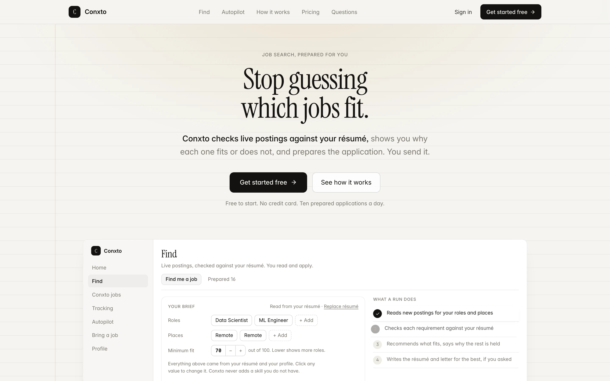
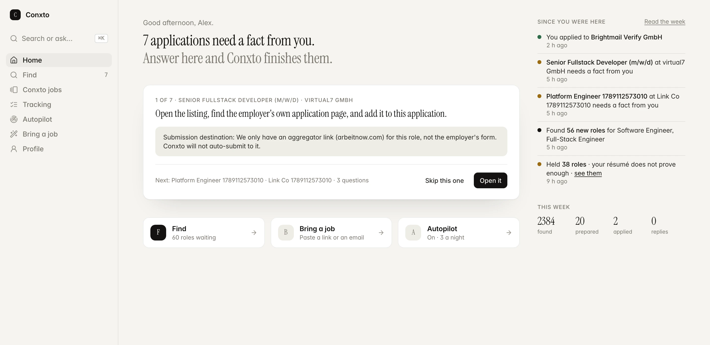

# Conxto

Conxto is in private beta.

It reads live job postings against your résumé, tells you which roles fit and why the rest are held, and writes the application: a tailored résumé with every change marked, a cover letter in the posting's language, and screening answers from facts you confirmed. You read it and apply. Nothing is sent without your click.

[conxto.com](https://conxto.com). Access is by request.

## Products

| Product | What happens | Status |
|---|---|---|
| **Find** | Your brief is read from your résumé. Conxto checks live postings against it, one requirement at a time, and prepares the package for the ones that fit. | Live |
| **Conxto jobs** | Every posting Conxto collects, newest first, with filters. Save or skip; the ones that fit your résumé are marked. Prepare is the only door into an application. | Live |
| **Bring a job** | Paste a posting you found, as a link, as text, or as an address to apply by email. It comes back as the same package. | Live |
| **Application** | The résumé Conxto wrote, on the page, with every changed line marked in red and its original in the margin; every proven requirement in green with the line that proves it; every open question in amber with its answer. | Live |
| **Tracking** | Every role you applied to and what happened since. Replies you paste are read and filed. | Live |
| **Autopilot** | The same work at night, inside rules you write. Prepares up to your limit and waits for your approval. Email applications go from your own Gmail after you see the preview. | Beta, paid plan |

## How it works

Conxto is not a wrapper around one prompt. It is a job search engine, a truthfulness engine, an AI router, a memory, a team of agents and an automation layer, each doing one job and leaving a receipt.

### Our own job search engine

- Conxto collects postings itself. As of today: 622,000 postings collected, 79,000 active, from 21 sources, including the career pages of companies on Ashby, Greenhouse, Join, Lever, Personio, Recruitee, SmartRecruiters, Workable and Workday, and public feeds for remote roles.
- Feeds are pulled about every thirty minutes, company career pages are swept through the day. Duplicates across sources are merged into one job record.
- Every posting is read for its language, its requirements, and its apply destination. Requirements are taken from the sections that state them, not from the company blurb.
- Every job is scored for a person along four axes: role family, keywords, seniority and place. The score is then capped by what the résumé actually proves, so a role cannot show a high fit with nothing behind it.
- Nine gates decide what Conxto may act on: eligibility, work mode, location, seniority, experience, compensation, posting status, score, and evidence for the must-haves. A gate that stops a role says why, in the posting's own words, and a stop never hides the role.

### The truthfulness engine

Tailoring is a pipeline, not a rewrite: read the posting's requirements, match each one to a line in the résumé, plan which bullets are worth moving, rewrite them, then a separate judge checks every changed line against the original and reverts anything that says more than the source did.

- Every change is stored with its original and shown in the margin of the application.
- A summary may drop and reorder, never add a noun that is not in the résumé or the posting.
- A cover letter is written in the posting's language, and every sentence that makes a claim must reuse the words of the résumé line it cites, or it is dropped.
- Proper names keep their casing. Punctuation is normalised. Nothing that would trip an applicant tracking system is left in.
- When the model cannot run, the résumé is delivered unchanged and labelled as such. An unchanged copy is never called prepared.

### The AI router

- Eight providers are wired, with a ranking per task and a rolling daily quota ledger. Free accounts run on a free lane that never falls back to a paid provider.
- Work is classified by privacy tier. Text that carries a person's identifiers is pseudonymised before it leaves the server, so the tailoring itself can run on free capacity while the identity never travels.
- Every call leaves a receipt: provider, model, tokens, latency, outcome. 900 receipts so far. The router parks a model that hits its daily wall and moves on.

### Memory

- Every conversation turn is logged, then a background worker distils durable facts from it and embeds them.
- Retrieval is hybrid: vector similarity, keyword rank, recency and importance, scoped to one person so nothing crosses accounts. Without the embedding service it degrades to keyword search rather than failing.
- A slow reflection pass turns piles of small facts into a few insights, such as which roles a person keeps walking away from.
- Facts that gate a send, work authorization, notice period, contact email, are asked once and stored only after the person confirms them. Nothing is guessed.

### The agents

- Ask Conxto is one career strategist with three specialist roles behind it: strategy, identity, and operations. A request is routed to the role that owns it, and the tools it may call are registered with an owner and a planner.
- Answers come in tiers. Questions the workspace can answer from its own state are answered without a model, and say so. Everything else goes to the model with the workspace reading and the memory as grounding.
- The agent is screen aware: it knows which page you are on and what is in front of you.
- Every action that touches the real world is proposal only. The person approves.

### Autopilot

- Rules are written in plain words and versioned. Changing them re-checks every role.
- Each mandate runs once a night in its own time window, prepares up to its limit, and stops on the first question only the person can answer.
- Submission is a real browser engine for the supported applicant systems, with twelve reasons to stop and hand back to a human, among them a CAPTCHA, a login wall, a consent box, an equal-opportunity form, and a compensation question. It never solves a CAPTCHA and never uses a source whose terms forbid automation.
- Email applications go from the person's own Gmail after a preview and a click. Auto mode requires an explicit, versioned authority receipt, and even then confirms the first sends.
- A morning digest reports checked, prepared, needs you, sent.

### Everything leaves a receipt

Applications carry their origin, their downloads, their sends and the status of every requirement. Tracking follows what happened after. Deletion and export of an account are one request each.

## What it will never do

- Invent a fact. Every changed line traces to your résumé or to an answer you gave.
- Send without you. An application leaves only after you press Send on its preview.
- Solve a CAPTCHA, log in as you, or use a job source whose terms forbid automation.
- Guess a company's question. It comes to you.
- Read your inbox. The Gmail permission is send only.

## Screens

## Beta notes

- Free accounts can prepare ten applications a day. A cap on every free service is planned.
- The AI lane runs on free providers first. A few sentences in cover letters still come out short on the weaker models; the fallback is a truthful template, never an invented letter.
- Autopilot's nightly run is wired and verified on the test environment. Production runs begin when the first beta user turns it on.
- Gmail sending uses Google's testing mode. A connection expires after seven days and asks to reconnect. That ends when the app is verified.
- Interview preparation is one card today, not a product.

## Reporting

Bugs and requests go to [Issues](../../issues). Security matters go to the address in [SECURITY.md](SECURITY.md). Please do not post résumés, postings with personal data, or screenshots of your own account in public issues.

## Code

The code is private during the beta.

---

All content in this repository is © VVDex, all rights reserved. Conxto is a VVDex product, Magdeburg, Germany.
