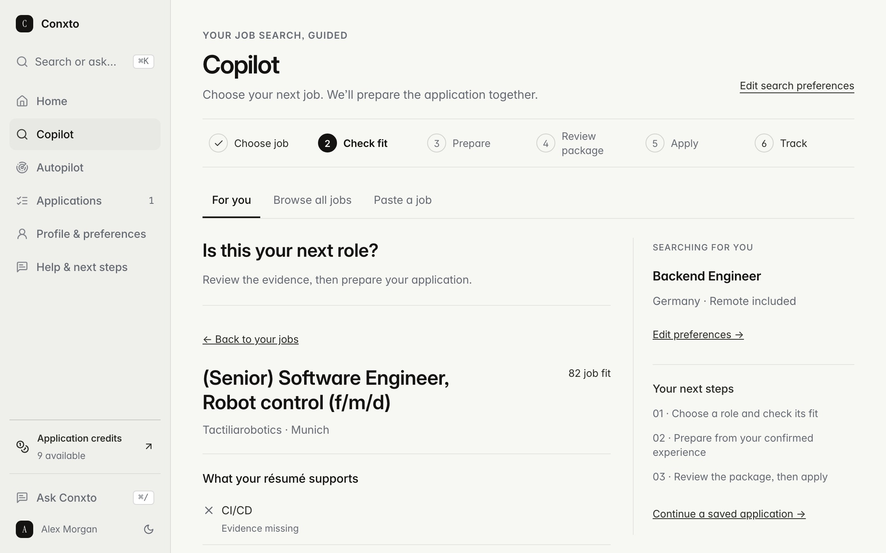
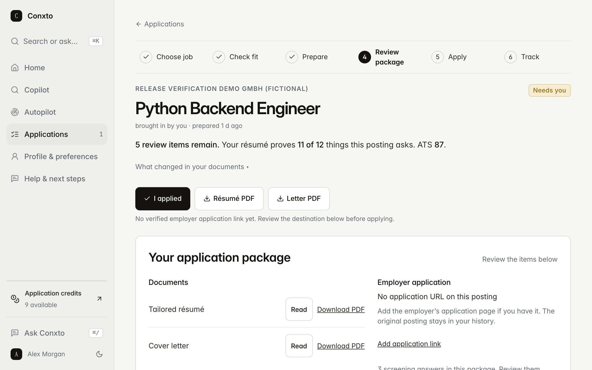
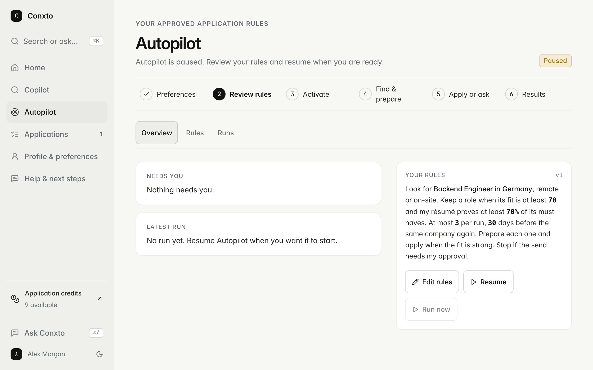

# Conxto

Conxto is in private beta.

It reads live job postings against your résumé, tells you which roles fit and what is missing for the rest, and prepares the application: a tailored résumé, a cover letter, screening answers from facts you confirmed, and a draft email where the employer takes applications by email. You review the package and apply.

[conxto.com](https://conxto.com). Access is by request.

## Products

| Product | What happens | Status |
|---|---|---|
| **Copilot** | Choose your role, country and remote preference. Conxto finds live postings, checks each one against your résumé one requirement at a time, and prepares the package for the ones you pick. | Live |
| **Bring a job** | Paste a posting you found, as a link or as text. It comes back as the same package. | Live, free |
| **Browse jobs** | Every collected posting across roles and countries. Check your fit, then prepare. | Live, free |
| **Applications** | One place per application: choose job, check fit, prepare, review, apply, track. Downloads, screening answers and what happened after you applied. | Live |
| **Profile & preferences** | What Conxto read from your résumé and what you confirmed, editable in place. Countries you want to work in, and your work authorization for each. | Live |
| **Ask Conxto** | A career assistant with a team of specialist agents behind it, answering from your own workspace and memory. | Live |
| **Autopilot** | You set a target: roles, places, minimum fit, how many per run. It searches inside those rules, prepares packages for the roles that clear your bar, skips weak fits, and reports every run. | Beta, by approval |

Free accounts can prepare ten applications a day. Remaining credits are shown in the app. Paid plans have not launched.

## How it works

### Our own job search engine

- Conxto collects postings itself from public job boards, job feeds and company career pages. As of 15 September 2026: 674,746 postings collected, 81,615 active, from 22 sources, across 30,737 companies with active postings.
- Feeds are pulled about every thirty minutes; company career pages are swept through the day. Duplicates across sources are merged into one job record.
- Every posting is read for its language, its requirements and its apply destination. Requirements are taken from the sections that state them, not from the company description.
- Every job is scored against your résumé, and the score is capped by what the résumé actually proves, so a role cannot show a high fit with nothing behind it.
- Gates decide what Conxto may act on: eligibility, work mode, location, seniority, experience, compensation, posting status, score, and evidence for the must-haves. A gate that stops a role says why, and the role stays visible.

### The truthfulness engine

Tailoring is a pipeline, not a single rewrite: read the posting's requirements, match each one to a line in your résumé, decide which lines are worth moving, rewrite them, then check every changed line against the original and revert anything that says more than the source did.

- Every change is stored with its original, so you can see what changed in your documents.
- A résumé line that denies a skill is never counted as evidence for it.
- A cover letter is written in the posting's language from what your résumé shows.
- When a model cannot run, the résumé is delivered unchanged and labelled as such. An unchanged copy is never called prepared.

### AI routing

- AI work goes through our own router across several providers. Each task is matched to a model by privacy class, capability and quality, with a rolling quota ledger.
- When a provider is unavailable, out of capacity or low on credit, work rotates to the next eligible model automatically.
- For tailoring, your name, contact details and employers are replaced before the text leaves our server, and the call is refused if they are still present.
- Every call leaves a receipt: provider, model, tokens, latency, outcome. 1,078 receipts as of 15 September 2026.

### The agents

- Ask Conxto is one conversation with a team behind it: a Strategist that plans your search, and four specialists that own their part of it: Identity (your résumé, profile and skills), Market (finding and ranking roles), Application (tailoring, letters, packages) and Operations (tracking and follow-ups). The Strategist can also call in two internal reviewers, a recruiter's eye and a critic.
- The Strategist hands a request to the specialists that own it, at most two per turn, one after another so they never overwrite each other's work. Every handoff is recorded.
- Answers come in tiers. Questions the workspace can answer from its own records, such as your targets, your counts or what is on the screen in front of you, are answered without a model and every figure comes from your data. Everything else goes to the model with your workspace and memory as grounding.
- Agents propose; you decide. Any action that changes something in the real world is shown as a proposal and runs only after you approve it.

### Persistent memory

- Conxto remembers across sessions. A background worker distils durable facts from what you do and say, merges them with what it already knows, and embeds them for search.
- Recall is hybrid: meaning similarity, keyword rank, recency and importance, scored together. If the embedding service is down, it falls back to keyword search instead of failing.
- A slower reflection pass turns many small facts into a few insights, such as the kind of roles you keep choosing or turning down.
- Memory ages: facts you never use fade over time and cold, low-importance ones are archived, while identity facts are never archived.
- Every memory is scoped to your account, so nothing crosses accounts.
- Facts that gate an application, such as work authorization, notice period or contact email, are asked once and stored only after you confirm them. Nothing is guessed. Profile lists what Conxto remembers, for you to edit or remove.

### Autopilot

- Rules are written in plain words and versioned. Changing them re-checks every role.
- Each run searches inside your rules, prepares up to your limit, and stops on the first question only you can answer.
- Every run leaves a report: checked, prepared, needs you, sent.
- Email applications go from your own Gmail after a preview. Automatic sending needs an explicit, versioned approval from you first.

### Everything leaves a receipt

Applications carry their origin, their downloads, their sends and the status of every requirement. Deletion and export of an account are one request each.

## What it will never do

- Invent a fact. Every changed line traces to your résumé or to an answer you gave.
- Send without your approval.
- Solve a CAPTCHA or log in to an employer site as you.
- Guess an answer to an employer's question. It comes to you.
- Read your inbox. The Gmail permission is send only.

## Screens

Fictional test account.

## Beta notes

- Autopilot is wired and tested on test accounts. It has not yet completed a run for a beta user in production.
- Gmail sending uses Google's testing mode. A connection expires after seven days and asks to reconnect.
- Interview preparation lives inside each application.
- WhatsApp alerts are not available.

## Reporting

Bugs and requests go to [Issues](../../issues). Security matters go to the address in [SECURITY.md](SECURITY.md). Please do not post résumés, postings with personal data, or screenshots of your own account in public issues.

## Code

The code is private during the beta.

---

All content in this repository is © VVDex, all rights reserved. Conxto is a VVDex product, Magdeburg, Germany.
